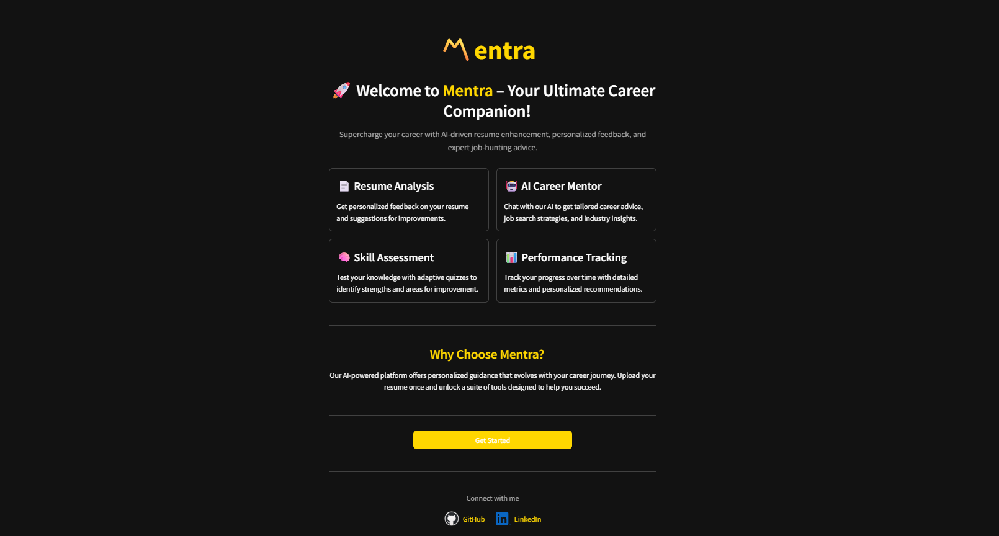
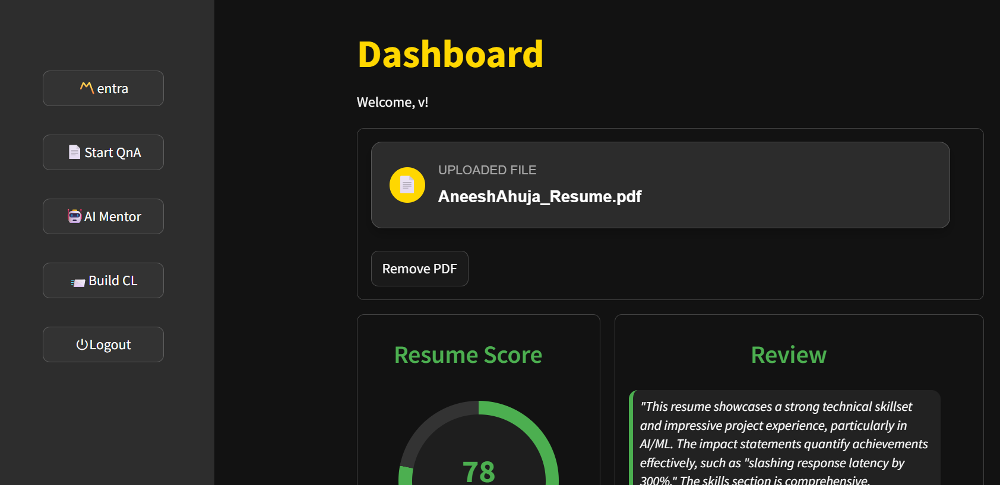
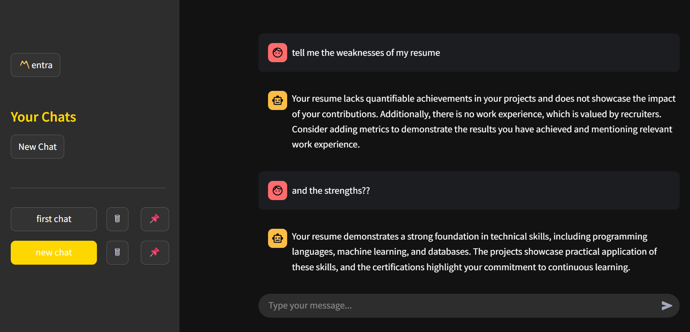
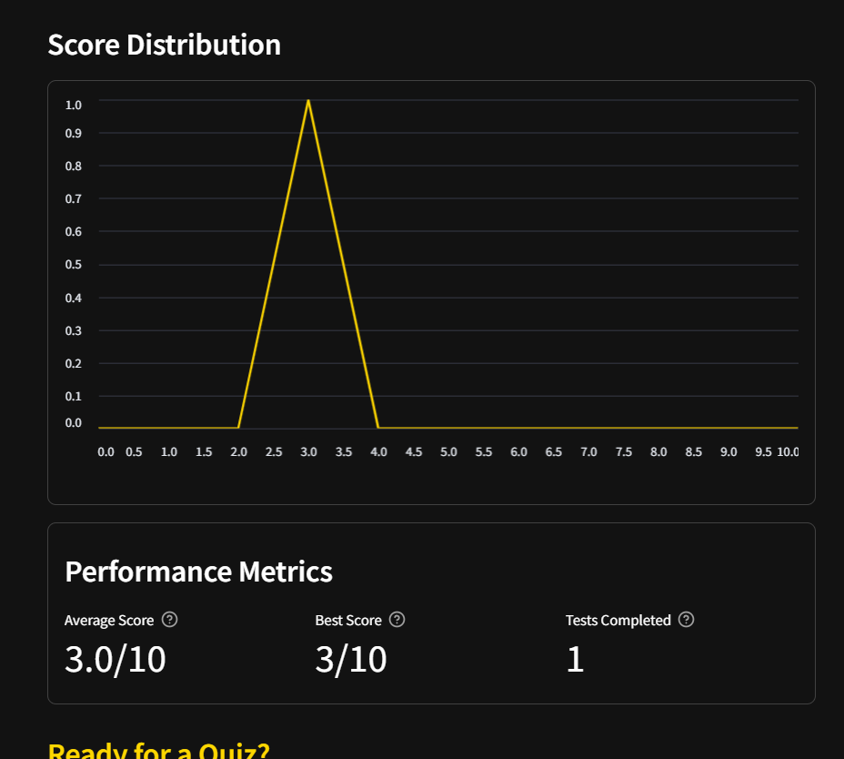
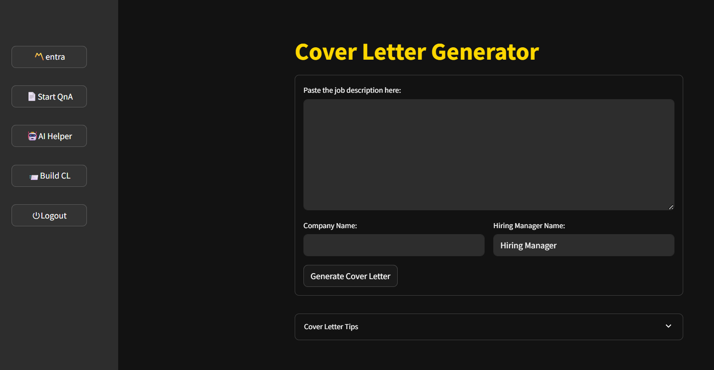

# Mentra

## Description
Mentra is an AI-powered career development platform designed to help job seekers optimize their professional materials, assess their skills, and receive personalized career guidance.

## 🚀 Live Demo

Check out the deployed app here: [Live Demo](https://mentra.aneeshahuja.tech)

## Table of Contents
- [Screenshots](#screenshots)
- [Features](#features)
- [Technologies Used](#technologies)
- [Installation](#installation)
- [Contact](#contact)


## Screenshots







## Features
1. 📄 Resume Analysis
- ATS Score & Review: Get your resume evaluated with a detailed Applicant.  Tracking System (ATS) compatibility score out of 100
- Actionable Feedback: Receive specific recommendations to improve your resume's impact and visibility to recruiters
- Visual Analytics: View your resume score with color-coded progress indicators

2. 🤖 AI Career Mentor
- Personalized Chat: Have conversations with an AI mentor trained on career development best practices
- Resume-Aware Guidance: The AI mentor has access to your resume content to provide highly personalized advice
- Chat Management: Create, organize, and bookmark important conversations for future reference
- Performance-Based Recommendations: Receive advice informed by your quiz performance and skill analytics

3. 🧠 Skill Assessment
- Resume-Based Quizzes: Take automatically generated technical quizzes tailored to the skills mentioned in your resume
- Performance Tracking: Monitor your progress across multiple quizzes with detailed analytics
- Knowledge Gap Analysis: Identify areas for improvement based on incorrect answers

4. 📨 Cover Letter Generator
- Job-Specific Content: Generate customized cover letters based on your resume and specific job descriptions
- Customization Options: Include company name and hiring manager details for a personalized touch
- Download Options: Save your cover letter as a text file for further editing
Formatting Tips: Access best practices for effective cover letters

5. 📊 User Dashboard
- Profile Management: View and manage your uploaded documents
- Bookmark System: Save important chats for quick access (up to 5 bookmarks)
Performance Overview: See all your test scores and resume evaluation at a glance

## Technologies
1. Frontend: Streamlit for UI and caching
2. Backend: FastAPI 
3. Database: MongoDB for user data, chat history, and application state
4. AI Components:
- LangChain for workflow orchestration
- Google Generative AI (Gemini) for intelligence features

5. Authentication: Secure user authentication and session management


## Installation
```bash
git clone https://github.com/AneeshAhuja31/Mentra.git

cd server
pip install -r requirements.txt

cd client
pip install -r requirements.txt

cd server
uvicorn app:app --reload

cd client
streamlit run streamlit_.py
```


## Contact
[Aneesh Ahuja] - [aneeshahuja31@gmail.com]

